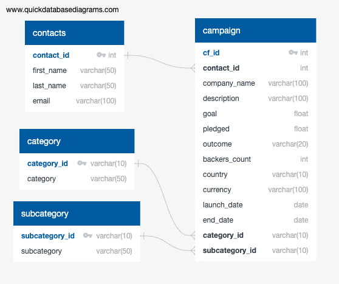
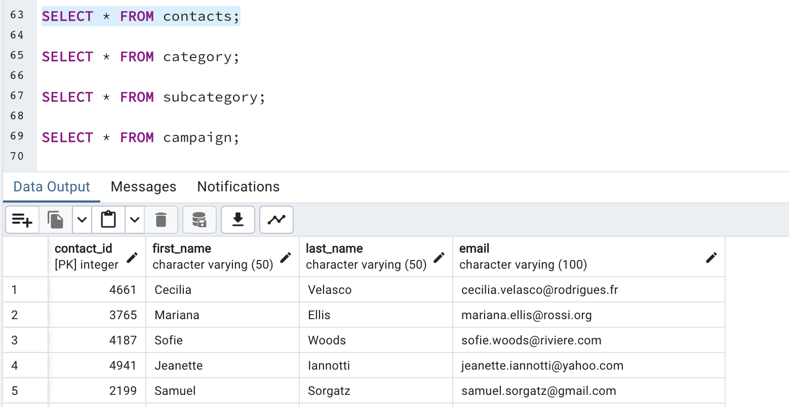

# Crowdfunding_ETL - ETL Mini Project: Crowdfunding Data Analysis

## Contents
1. [Overview](#1-overview)  
2. [Repository](#2-repository)  
3. [Deployment](#3-deployment)  
4. [Data ETL](#4-data-etl)
5. [Resources](#5-resources)  

## 1. Overview
This Crowdfunding ETL (Extract, Transform, Load) Mini Project involves building an ETL pipeline to process and analyse crowdfunding data. The project includes data extraction and transformation using Python and Pandas, followed by exporting the data into CSV files for further use. These CSV files are then used to create an Entity-Relationship Diagram (ERD) and a database schema, which are implemented in a PostgreSQL database. The processed data is analysed to provide meaningful insights into the crowdfunding campaign landscape.

## 2. Repository
The repository includes the following structure:

### Jupyter Notebook
- **[`ETL_Mini_Project.ipynb`](ETL_Mini_Project.ipynb)**: The main notebook implementing the ETL pipeline.

### Individual Notebooks
- **[`individual_notebooks/`](individual_notebooks)**: Contains intermediate notebooks used during collaboration.

### Raw Data
- **`resources/contacts.xlsx`**: Contact details for crowdfunding campaigns.  
- **`resources/crowdfunding.xlsx`**: Crowdfunding campaign details, including financial and categorical information.

### Exported Data
- **`resources/campaign.csv`**: Transformed campaign data.  
- **`resources/contacts.csv`**: Transformed contact data.  
- **`resources/category.csv`**: Transformed category data.  
- **`resources/subcategory.csv`**: Transformed subcategory data.  

### SQL Files
- **`SQL/crowdfunding_db_schema.sql`**: SQL script for creating the database schema.  
- **[`SQL/erd.png`](SQL/erd.png)**: Entity-Relationship Diagram (ERD) in PNG format.  
- **`SQL/erd.txt`**: ERD in text format.

### SQL Screenshots
- Screenshots of SQL tables:
    - **[`SQL/table_screenshots/campaign_screenshot1.png`](SQL/table_screenshots/campaign_screenshot1.png)**  
    - **[`SQL/table_screenshots/campaign_screenshot2.png`](SQL/table_screenshots/campaign_screenshot2.png)**    
    - **[`SQL/table_screenshots/contacts_screenshot.png`](SQL/table_screenshots/contacts_screenshot.png)**
    - **[`SQL/table_screenshots/category_screenshot.png`](SQL/table_screenshots/category_screenshot.png)**
    - **[`SQL/table_screenshots/subcategory_screenshot.png`](SQL/table_screenshots/subcategory_screenshot.png)**  

## 3. Deployment
To deploy the ETL pipeline and database:

1. Ensure the following Python libraries are installed:
    - `pandas`
    - `numpy`
    - `datetime`
    - `json`
2. Clone the repository to your local machine.
3. Open `ETL_Mini_Project.ipynb` in Jupyter Notebook and execute the cells step-by-step.
4. Run the `SQL/crowdfunding_db_schema.sql` script in PostgreSQL to create the database.

**Note**: The `DROP DATABASE` and `CREATE DATABASE` commands must be run in `PSQL`, the terminal-based front-end for PostgreSQL.

5. Import the transformed CSV files into the corresponding database tables.

## 4. Data ETL
This project processes the following datasets:

1. **Campaign Data**: Includes information about crowdfunding campaigns such as goals, pledged amounts, and outcomes.  
2. **Contact Data**: Contains contact details of campaign organisers, including names and email addresses.  
3. **Category and Subcategory Data**: Classifies campaigns into specific categories and subcategories for structured analysis.  

The processed data is stored in a PostgreSQL database with appropriate relationships defined between the tables.

## 5. Resources
- This project was developed as part of an ETL mini project to practise data extraction, transformation, and loading.
- The ERD was created using [QuickDBD](http://www.quickdatabasediagrams.com/).
- PostgreSQL was used for database implementation and analysis.
